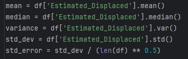
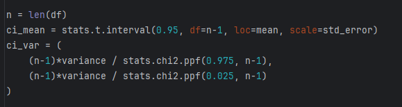
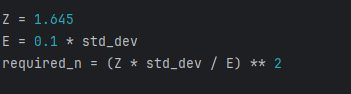
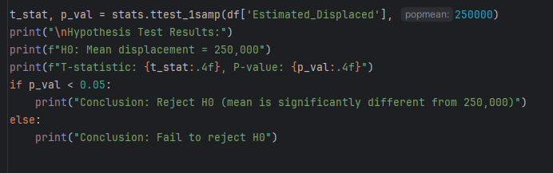

# 📊 Nakba in Numbers: A Statistical Analysis of Palestinian Displacement (1947–2023)


A statistical analysis of estimated Palestinian displacement across major historical events from the 1948 Nakba to 2023. This project applies **descriptive statistics**, **confidence intervals**, **sample size estimation**, and **hypothesis testing** to a curated historical dataset.

---

## 📁 Project Structure

```
├── README.md
├── LICENSE
├── requirements.txt
├── .gitignore
├── data/
│   └── Nakba_Displacement_Historical.csv   # Source dataset
├── src/
│   └── analysis.py                         # Main analysis script
├── outputs/
│   └── Displacement_Plots.png              # Generated visualizations
└── docs/
    ├── report.pdf                          # Full written report
    └── screenshots/                        # Result screenshots
```

---

## 📈 Dataset

The dataset (`data/Nakba_Displacement_Historical.csv`) contains **8 records** spanning **1947–2023**:

| Period | Estimated Displaced | Notes |
|---|---:|---|
| Dec 1947 – Mar 1948 | 85,000 | Initial violence and elite urban flight |
| Apr – May 14, 1948 | 230,000 | Plan Dalet: major offensives, Deir Yassin massacre |
| May 15 – Oct 1948 | 300,000 | Arab-Israeli war escalation, Lydda/Ramle expulsions |
| Oct 1948 – Jul 1949 | 135,000 | Post-war clearances, Safsaf and al-Dawayima massacres |
| Post-1949 martial law | 46,000 | Martial law era; internal refugees inside Israel |
| 1967 Naksa | 300,000 | 1967 War: displacement from West Bank/Gaza |
| 1982 Sabra & Shatila | 3,000 | 1982 Lebanon war: refugee massacre |
| 2000–2023 | 250,000 | Second Intifada, Gaza blockade, 2023 conflict |

---

## 🔬 Methods

| Analysis | Description |
|---|---|
| **Descriptive Statistics** | Mean, median, variance, standard deviation, standard error |
| **Confidence Intervals** | 95% CI for the population mean (t-distribution) and variance (χ² distribution) |
| **Sample Size Estimation** | Required *n* for margin = 10% of σ at 90% confidence |
| **Hypothesis Testing** | One-sample t-test: H₀: μ = 250,000 vs H₁: μ ≠ 250,000 |
| **Visualization** | Histogram with KDE overlay and boxplot for outlier detection |

---

## 📸 Results

### Descriptive Statistics
<p align="center">
  
</p>

### Confidence Intervals
<p align="center">
  
</p>

### Sample Size Estimation
<p align="center">
  
</p>

### Hypothesis Testing
<p align="center">
  
</p>

### Visualization
<p align="center">
  
</p>

---

## 🚀 Getting Started

### Prerequisites

- Python 3.10 or higher

### Installation

```bash
# Clone the repository
git clone https://github.com/your-username/palestinian-displacement-analysis.git
cd palestinian-displacement-analysis

# Create a virtual environment (recommended)
python -m venv venv
source venv/bin/activate   # Linux / macOS
venv\Scripts\activate      # Windows

# Install dependencies
pip install -r requirements.txt
```

### Run the Analysis

```bash
python src/analysis.py
```

The script will print all statistical results to the console and save the visualization to `outputs/Displacement_Plots.png`.

---

## 🛠️ Built With

- [pandas](https://pandas.pydata.org/) — Data manipulation
- [matplotlib](https://matplotlib.org/) — Plotting
- [seaborn](https://seaborn.pydata.org/) — Statistical visualization
- [scipy](https://scipy.org/) — Hypothesis testing & distributions

---

## 📄 License

This project is licensed under the **MIT License** — see the [LICENSE](LICENSE) file for details.

---

## 👤 Author

**Abdelfatah M.A Alhoot**  
Student ID: 2321051372
